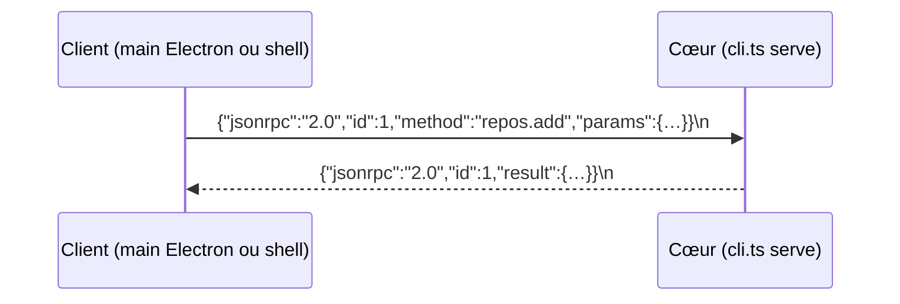

# Cœur séparé et protocole typé

## En une phrase

Toute la logique de jam vit dans un **processus à part**, le cœur, qui ne parle qu'un protocole : des messages JSON-RPC, un par ligne, sur son entrée et sa sortie standard.

## Le problème

Le cœur doit tourner sans interface : en CLI, plus tard sur le VPS, et sous un agent ([ADR 0006](../decisions/0006-coeur-separe-ui.md)). Si la logique vivait dans le main d'Electron, elle n'existerait que dans l'app. Il faut aussi que l'humain (palette) et, plus tard, l'agent (MCP) déclenchent les mêmes actions sans code dupliqué ([ADR 0007](../decisions/0007-commandes-ui-partagees-agent.md)).

## Comment ça marche

- **JSON-RPC 2.0** : chaque requête porte un `id`, une `method` et des `params` ; la réponse reprend l'`id` avec un `result` ou une `error` (`code`, `message`). Codes utilisés : -32700 (JSON illisible), -32600 (enveloppe invalide), -32601 (méthode inconnue), -32602 (paramètres invalides), -32603 (erreur interne) et -32001 (repo invalide). `packages/protocol/src/jsonrpc.ts`.
- **NDJSON** : un message JSON par ligne. Le découpeur garde le morceau de ligne incomplet jusqu'au `\n` suivant (`ndjson.ts`). Le cadrage marche sur n'importe quel flux : passer à un socket Unix ne changera pas le protocole.
- **stdio** : stdin et stdout portent le protocole, stderr porte les logs. On le teste au terminal : `pnpm core:ping`.
- **Schémas zod, source unique** : `methods.ts` associe chaque méthode à `{ params, result }`. Les types TypeScript en sont inférés, et les mêmes schémas valident à l'exécution : le serveur valide les paramètres, le client valide les résultats (`client.ts`).
- **Concurrence** : le serveur traite les requêtes en parallèle et répond dans l'ordre où elles finissent ; le client retrouve chaque réponse par son `id`.
- **Registre de commandes** (`packages/core/src/commands.ts`) : une commande a un `id`, un titre et la méthode qu'elle appelle. Son `paramsSchema` est calculé par `z.toJSONSchema` à partir du schéma zod de la méthode : c'est le format qu'attendent les outils MCP. La palette construit son formulaire à partir de ce JSON Schema (`schema-fields.ts`).
- **Persistance** : SQLite via `node:sqlite` ([ADR 0010](../decisions/0010-persistance-sqlite.md)). `PRAGMA user_version` (un entier libre dans l'en-tête du fichier) compte les migrations appliquées ; `openDatabase` applique les suivantes dans une transaction, c'est-à-dire tout ou rien : si une migration échoue, aucune n'est gardée (`packages/core/src/db/`).
- **Sans build** : Node 24 exécute le TypeScript directement (type stripping). Le même `cli.ts` tourne en CLI, en test et sous Electron.

## Les pièges

- **Syntaxe effaçable seulement** : ni `enum`, ni propriétés de paramètre de constructeur, ni `namespace` (`erasableSyntaxOnly`). Node retire les types sans rien compiler, il ne sait donc pas traduire ces constructions : si un agent en écrit une, le cœur ne démarre plus (le typecheck le signale avant). Les imports locaux portent l'extension `.ts`.
- **Pas de type stripping dans `node_modules`** : les paquets du workspace sont des liens symboliques, que Node résout vers `packages/…`, donc ça marche. Le main d'Electron, lui, est bundlé (regroupé en un seul fichier JavaScript au build) et ce fichier contient déjà `@jam/protocol`.
- **stdout est réservé** : un `console.log` dans le cœur casserait le protocole. Les logs passent par `console.error`.
- **Fin du cœur** : quand stdin se ferme, le cœur termine les requêtes en cours, ferme la base et s'arrête. C'est ainsi que l'app l'arrête proprement.
- **Une migration livrée ne se modifie jamais** : on en ajoute une nouvelle à la fin de la liste.
- `node:sqlite` affiche un `ExperimentalWarning` sous Node 25 (pas sous Node 24.21, version épinglée).

## Pour aller plus loin

- [Spécification JSON-RPC 2.0](https://www.jsonrpc.org/specification)
- [NDJSON](https://github.com/ndjson/ndjson-spec)
- [Node : type stripping](https://nodejs.org/api/typescript.html) et [`node:sqlite`](https://nodejs.org/api/sqlite.html)
- [zod : JSON Schema](https://zod.dev/json-schema)
- Fiche voisine : [processus Electron](processus-electron.md)
