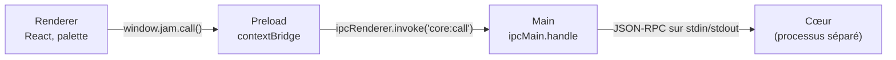

# Processus Electron : main, preload, renderer

## En une phrase

Une app Electron est faite de plusieurs processus : le **main** (Node, accès au système), un **renderer** par fenêtre (une page web, sans accès au système) et un **preload** qui choisit ce que la page a le droit d'appeler.

## Le problème

La fenêtre affiche du HTML et du JavaScript. Si cette page avait accès à Node, une faille dans l'interface (ou un contenu affiché) donnerait la main sur toute la machine. Il faut donc une interface riche **sans** donner Node à la page, tout en lui permettant de parler au cœur.

## Comment ça marche

- **Main** (`apps/desktop/src/main/index.ts`) : crée la fenêtre, lance le cœur (`core-process.ts`), relaie les appels. Il vérifie que la méthode demandée existe dans le protocole ; le cœur valide ensuite les paramètres.
- **Preload** (`apps/desktop/src/preload/index.ts`) : s'exécute avant la page, dans un monde JavaScript séparé. `contextBridge.exposeInMainWorld('jam', …)` publie un seul objet, `window.jam`, avec une seule fonction, `call(method, params)`.
- **Renderer** (`apps/desktop/src/renderer/`) : React. Il ne connaît que `window.jam`, typé par `CoreApi` (`packages/protocol/src/methods.ts`).
- **IPC `invoke`/`handle`** : une requête du renderer vers le main qui renvoie une promesse. Une exception côté main devient un rejet côté renderer.
- **Réglages de sécurité** de la fenêtre : `contextIsolation: true` (la page ne voit pas les objets du preload), `sandbox: true` (le renderer et le preload tournent dans le bac à sable de Chromium), `nodeIntegration: false` (pas de `require` dans la page).
- **CSP** (`Content-Security-Policy`, dans `renderer/index.html`) : la page ne charge que ses propres scripts. Même une donnée piégée affichée dans la page ne peut pas exécuter de code venu d'ailleurs.
- **Pas de navigation** : la fenêtre refuse d'ouvrir des pop-ups ou de quitter la page de l'app, et le main n'accepte `core:call` que depuis cette fenêtre. Une page étrangère ne peut donc jamais atteindre `window.jam`.
- **`ELECTRON_RUN_AS_NODE=1`** : le main lance le cœur avec `process.execPath`, c'est-à-dire le binaire Electron lui-même. Avec cette variable, Electron se comporte comme le Node qu'il embarque (Node 24.21 pour Electron 44). L'app n'a donc pas besoin d'un Node installé sur la machine.

## Les pièges

- **Un preload sandboxé doit être en CommonJS.** CommonJS et « module ES » sont deux formats de fichiers JavaScript : l'ancien, qui charge le code avec `require` (fichiers `.cjs`), et le moderne, qui utilise `import` (fichiers `.mjs`). Un preload sandboxé n'accepte que l'ancien. Le paquet étant `"type": "module"`, electron-vite produirait un `.mjs` : la config force `index.cjs` (`electron.vite.config.ts`).
- **Messages d'erreur IPC** : Electron préfixe les erreurs (« Error invoking remote method 'core:call': … »). `renderer/errors.ts` retire ce préfixe avant affichage.
- **`utilityProcess`** (l'API Electron pour lancer un processus Node) ne permet pas de brancher stdin, et son canal `MessagePort` n'existerait pas en CLI. D'où `child_process.spawn`.
- **Dossier de données** : `app.getPath('userData')` dépend du nom de l'app. `productName: "jam"` dans `apps/desktop/package.json` le fixe à `~/Library/Application Support/jam`, le même dossier que le CLI.
- En dev, `ELECTRON_RENDERER_URL` pointe vers le serveur Vite ; en build, la page est chargée depuis `out/renderer`.
- **Le binaire Electron est téléchargé à la demande.** Le paquet `electron` ne contient pas l'app Electron (environ 100 Mo), seulement de quoi la télécharger. Electron 44 n'a pas de script `postinstall` : `pnpm install` ne télécharge rien, et le binaire arrive au premier `require('electron')`. Or electron-vite ne fait pas ce `require` : il lit directement `node_modules/electron/path.txt`, que seul le téléchargement crée. Sur une installation neuve, `pnpm dev` échouait donc avec `Error: Electron uninstall`. D'où le script `electron:install` (`apps/desktop/package.json`), que `dev` appelle avant electron-vite. Il lance `install-electron`, la commande de téléchargement fournie par Electron, qui ne fait rien si le binaire est déjà là. La CI lance la même étape, puis vérifie `path.txt` comme le lit electron-vite.
- **Recette d'une installation neuve : `pnpm dev` en premier.** Un test qui charge Electron (Playwright, ou tout `require('electron')`) télécharge le binaire en passant. S'il tourne avant `pnpm dev`, il masque le défaut.

## Pour aller plus loin

- [Process model](https://www.electronjs.org/docs/latest/tutorial/process-model)
- [Context isolation](https://www.electronjs.org/docs/latest/tutorial/context-isolation) et [sandbox](https://www.electronjs.org/docs/latest/tutorial/sandbox)
- [IPC](https://www.electronjs.org/docs/latest/tutorial/ipc)
- [electron-vite](https://electron-vite.org/guide/)
- Fiche voisine : [cœur séparé et protocole](coeur-separe-protocole.md)
