# ADR 0008 — Le MVP est la boucle extérieure : le pipeline du mainteneur, codé dans le cœur

- **Statut** : acceptée
- **Date** : 2026-10-08
- **Tranche** : lot 3 bis (questions 1 à 6 et 8)

## Contexte

L'analyse d'usage ([docs/research/usage-2026-10.md](../research/usage-2026-10.md)) montre que le mainteneur travaille déjà selon un pipeline stable :

> issue → plan → feu vert → TDD → relecture indépendante → recette → feu vert → PR + CI → merge

Aujourd'hui, ce pipeline est déroulé par un **coordinateur LLM**. Il ne tient que si l'agent obéit, d'où les frictions observées :

- des agents qui débordent ;
- des questions qui restent invisibles ;
- un passage de relais manuel avant chaque `/clear` ;
- des notifications trop bruyantes.

La pratique appelée *loop engineering* (A. Osmani, 2026) formalise cette approche. Un système extérieur trouve le travail, le confie à un agent, fait vérifier le résultat par un second agent et garde l'état hors du contexte du modèle.

L'idée d'une « équipe » d'agents permanents (produit, architecture…) qui dialoguent entre eux a été écartée. Elle coûte cher, provoque de la dérive et augmente le bruit.

## Décision

**La boucle extérieure** est implémentée **en code dans le cœur**, et non confiée à un LLM. C'est le pipeline du mainteneur, **codé en dur** : une liste d'étapes, et non un moteur de workflow générique.

```mermaid
flowchart LR
  I[Issue GitHub] --> W[Worktree]
  W --> P["Plan<br/>(rôle : planificateur, lecture seule)"]
  P --> G1{{"Feu vert 1<br/>plan"}}
  G1 --> D["Implémentation TDD<br/>boucle jusqu'aux tests verts"]
  D --> R["Relecture<br/>(contexte neuf)"]
  R -->|corrections| D
  R --> Q["Recette<br/>(agent, puis mainteneur)"]
  Q --> G2{{"Feu vert 2<br/>recette"}}
  G2 --> PR["PR + CI<br/>boucle jusqu'au vert"]
  PR --> G3{{"Feu vert 3<br/>merge"}}
  G3 --> M[Merge GitHub] --> N[Nettoyage]
```

- **Rôles** : chaque étape correspond à un rôle (planificateur, implémenteur, relecteur, recetteur). Un rôle est un profil (prompt, outils, permissions) instancié à la demande, avec un contexte neuf. **L'« équipe » est donc le pipeline**, et non un ensemble d'agents qui tournent en permanence.
- **Lead** : chaque worktree a une session principale à laquelle le mainteneur peut parler.
- **Boucles automatiques** uniquement sur des critères objectifs : tests verts, CI verte. Le plan, la recette et le merge passent par **trois feux verts humains**.
- **Garde-fous** dès le départ : un nombre maximal d'itérations et un budget par étape. Un dépassement produit un état « bloqué » et une entrée dans la file « À toi ».
- **L'état vit dans le cœur** (persistance, thème 8) et dans les issues, pas dans le contexte d'un agent. Il survit donc à un clear ou à un redémarrage.
- **Notifications** : uniquement quand une décision attend le mainteneur ou qu'un agent est bloqué.
- **Acceptation** : PR, CI, puis `gh pr merge` après le feu vert 3. Le merge local est exclu.
- **Source d'une tâche** : une issue GitHub, désignée par son numéro.
- **Coordinateur conversationnel** (cadrage → issues, arbitrages) : il arrive **après** E0. En attendant, le cadrage se fait comme aujourd'hui.

## Conséquences

- (+) Le projet se distingue d'Orca : il exécute une méthode au lieu d'orchestrer des terminaux.
- (+) Le projet s'articule autour de deux concepts : la **boucle intérieure** (harness, E1) et la **boucle extérieure** (pipeline, E0).
- (+) Les irritants observés reçoivent une réponse structurelle : file « À toi », trois feux verts seulement, état persistant.
- (+) Moins de pièces mobiles qu'un coordinateur LLM qui pilote l'outil via MCP.
- (−) En E0, l'ordre des étapes est garanti par le code. En revanche, le respect du rôle **à l'intérieur** d'une étape (par exemple un planificateur qui n'écrit pas) repose encore sur le prompt et les permissions de Claude Code. L'imposer pleinement est un objectif du harness.
- (−) Le pipeline est propre au mainteneur. Il ne sera rendu configurable que si un deuxième pipeline réel apparaît.
- (−) Le périmètre d'E0 est serré pour un mois (voir la roadmap, liste de coupes).
