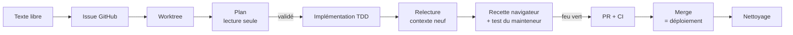

# Analyse d'usage : comment le mainteneur travaille avec des agents

> Étude du 2026-10-08, menée sur 177 sessions Claude Code, du 27/08 au 08/10/2026.
> Projets couverts : un projet client (environ 80 % des sessions), l'app perso `house` et des usages hors code.
> Ce document ne reprend aucune donnée de tiers ni aucun contenu personnel. Seule la méthode de travail est analysée.

## Chiffres clés

- 31 jours actifs, 5,7 sessions par jour en moyenne, avec un pic à 41 sessions dans la journée.
- Horaires : surtout de 21 h à 23 h (heure de Paris), et du jeudi au samedi.
- **3 messages du mainteneur par session** en médiane. Un tiers de ses messages fait 25 caractères ou moins (« go », « ok vas y », « on suit tes reco »).
- 424 sous-agents lancés, dont environ 67 agents de plan et une relecture indépendante quasi systématique.
- **Parallélisme** : 3 à 5 worktrees actifs d'habitude, 7 au maximum.
- Environ 55 PR mergées sur le projet client, toutes via `gh pr merge` une fois la CI verte. Un merge sur `main` déclenche le déploiement en production.

## Le modèle réel : mainteneur → coordinateur → workers

Le mainteneur ne fait pas face à N agents. **Il parle à un agent coordinateur.** C'est une session Claude Code ouverte dans le checkout principal, qui :

1. transforme les demandes en texte libre en **issues GitHub** ;
2. crée un worktree par issue (`orca worktree create --issue N`) ;
3. lance des **workers** avec un mandat structuré : cible, livrable, hors périmètre, critère d'acceptation ;
4. fait remonter au mainteneur les **décisions produit** sous forme de questions numérotées, auxquelles il répond « 1. ok 2. ok… » ;
5. fait relire chaque worker par un **relecteur à contexte neuf** ;
6. fait **recetter** chaque branche dans le navigateur (Playwright, port dédié), puis attend que le mainteneur ait testé lui-même ;
7. committe, pousse, ouvre la PR, surveille la CI, **merge**, puis **nettoie** le worktree et les branches.

Le mainteneur, lui, prend les décisions produit, donne les feux verts (push, merge) et fait la recette. **Il ne lit presque jamais de diff** : une seule demande en 76 sessions.

### Pipeline d'une tâche

## Règles répétées par le mainteneur

Elles sont stables d'une session à l'autre :

- un plan validé avant tout code ;
- TDD ;
- une relecture indépendante ;
- la spec prime sur l'issue ;
- une recette avant de présenter la PR ;
- un **accord explicite avant chaque push ou merge**, garanti par un hook ;
- ne parler au mainteneur que lorsqu'une décision l'attend ;
- pas de sur-ingénierie ;
- on ne sacrifie pas le process, on n'optimise que l'ordre.

## Frictions observées (que l'outil doit résoudre)

| Friction | Exemple |
|---|---|
| Notifications trop bruyantes | « une notif à chaque battement de coeur » ; environ 120 notifications d'orchestration recollées à la main |
| Questions en attente invisibles | « tu attends quoi de moi ? », « il y a un agent qui pose une question non ? » |
| Contexte saturé, passage de relais manuel | 27 `/clear`, chacun précédé de « update la mémoire je vais clear » |
| Agents qui sortent de leur rôle | « tu devais uniquement te charger de l'orga », un worker qui implémente sans y être invité |
| Collisions | deux sessions dans le même worktree, une pile Docker locale partagée |
| Visibilité et ménage des worktrees | « pourquoi je ne vois pas le worktree », relances pour nettoyer |
| Fiabilité du lancement | lancement de worker en échec (readiness), contourné en désactivant les permissions |
| Branches empilées | rebases et conflits à la charge du coordinateur |
| CI lente et coûteuse | 33 min de CI, budget Actions épuisé (hors périmètre de l'outil) |

## Usages hors code (catégories)

Environ 25 sessions, sans worktree :

- **Dossiers au long cours** : répertoire persistant + mémoire par thème + journal. On les reprend par « reprends le dossier X ».
- **Mails en brouillon** via Mail.app, en local sur le Mac. L'humain envoie lui-même.
- **Documents livrables** : HTML, PDF, tableurs.
- **Recherche web ponctuelle**, en sessions jetables.
- **Ops guidées** : VPS, sauvegardes, administration du Mac.
- Ces usages sont des **dialogues longs** (10 à 34 messages) avec beaucoup de corrections, et non des exécutions autonomes.

## Écarts avec les specs (au 2026-10-08)

| Décision provisoire | Verdict |
|---|---|
| Un worktree par tâche, 3 à 5 agents en parallèle | Conforme |
| Le mainteneur ne code pas | Conforme |
| « Accepter » = merge local | **Faux** : PR, CI, puis `gh pr merge` |
| La tâche part d'un texte libre | **À corriger** : elle part d'une issue, le texte libre sert au cadrage |
| Le mainteneur pilote N agents directement | **À corriger** : il passe par un coordinateur |
| Diff et accepter/refuser comme cœur de la revue | **À corriger** : la revue se fait par plan, relecture indépendante et recette |
| S2 : même tâche confiée à 3 agents | **Jamais observé** |
| Recherche de fichiers et éditeur en premières briques | **Faible valeur** pour un mainteneur qui ne lit pas le code |
