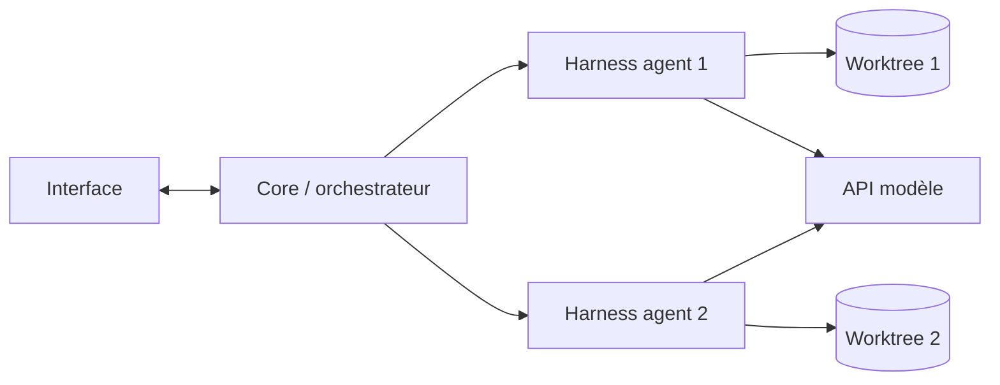

# 02 — Architecture

> Statut : vide. Rempli aux thèmes 4 (orchestration) et 6 (plateforme et stack).

## Vue d'ensemble

_Schéma provisoire, à valider._

## Composants

_À compléter._

## Flux principaux

_À compléter._

## Stack

| Couche | Choix | ADR |
|---|---|---|
| Shell desktop | _?_ | — |
| Langage du harness | _?_ | — |
| UI | _?_ | — |
| Persistance | _?_ | — |

## Exécution locale / distante

_À compléter._
