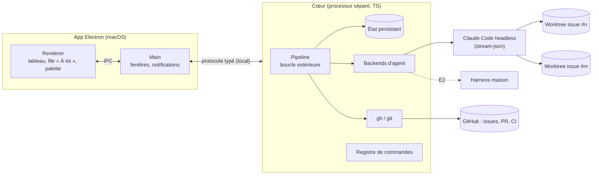

# 02 — Architecture

> Statut : stack posée (thème 6), composants alignés sur l'ADR 0008. Les flux détaillés seront remplis aux thèmes 3 et 4.

## Vue d'ensemble

## Composants

| Composant | Rôle | Étape |
|---|---|---|
| Renderer (React) | Tableau des tâches, file « À toi », fil résumé, palette Cmd+K, écran « Métriques » (FR-037) | E0 |
| Main (Electron) | Fenêtres, notifications natives, lancement du cœur | E0 |
| **Pipeline** | Boucle extérieure : enchaîne les étapes et les rôles, boucles tests/relecture/CI, garde-fous, feux verts ([ADR 0008](../decisions/0008-boucle-exterieure-pipeline.md)). Une étape peut lancer plusieurs instances d'un rôle : relecture par axes (FR-022) | E0 |
| État persistant | Tâches, étapes, itérations, coûts, questions, feux verts. SQLite ([ADR 0010](../decisions/0010-persistance-sqlite.md)) | E0 |
| Registre de commandes | Actions d'UI typées, partagées par la palette et l'agent ([ADR 0007](../decisions/0007-commandes-ui-partagees-agent.md)) | E0 |
| Intégration GitHub | Issues, création de PR, suivi de CI, merge et nettoyage via `gh`. Lecture des labels `incident` et des exécutions de workflow pour les métriques ([ADR 0011](../decisions/0011-pratiques-et-metriques-dora.md)) | E0 |
| Backend Claude Code | Lance `claude -p --output-format stream-json` avec un profil de rôle et son contexte d'environnement (FR-038) dans un worktree, et normalise les événements | E0 |
| Mesure | Calcule par repo les métriques DORA et les indicateurs agents, à partir de l'état horodaté (FR-036) et de GitHub ([ADR 0011](../decisions/0011-pratiques-et-metriques-dora.md)) | E0 (S4) |
| Coordinateur | Agent conversationnel : orchestre le cadrage (rédacteur → relecteur → feu vert), arbitre, pilote l'UI. Ne produit aucun livrable (FR-040, RET-001) | E0.5 |
| Backend harness maison | Boucle intérieure propre, rôles imposés | E1–E2 |

## Flux principaux

_À compléter au thème 4._

## Stack

| Couche | Choix | ADR |
|---|---|---|
| Shell desktop | Electron | [0005](../decisions/0005-electron-macos.md) |
| OS | macOS uniquement (cœur portable) | [0005](../decisions/0005-electron-macos.md) |
| UI | React + TypeScript | 0005 |
| Cœur | Processus séparé, protocole typé, local uniquement au MVP | [0006](../decisions/0006-coeur-separe-ui.md) |
| Langage du cœur | TypeScript strict + zod | [0006](../decisions/0006-coeur-separe-ui.md) |
| Intégration de Claude Code | Headless `stream-json` | [0004](../decisions/0004-claude-code-headless-stream-json.md) |
| Persistance | SQLite via `node:sqlite`, migrations numérotées (`PRAGMA user_version`) | [0010](../decisions/0010-persistance-sqlite.md) |

## Exécution locale / distante

- Local uniquement au MVP (NFR-007).
- Le cœur séparé permettra plus tard de le faire tourner sur le VPS, avec l'UI connectée par tunnel. C'est repoussé.
